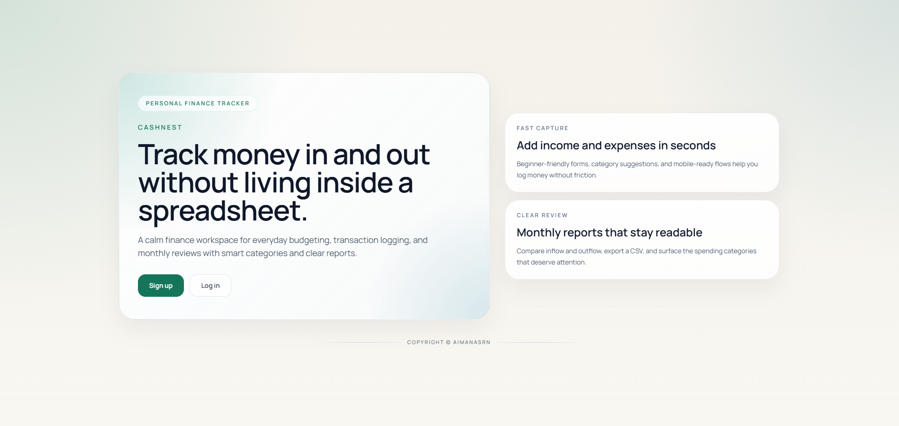
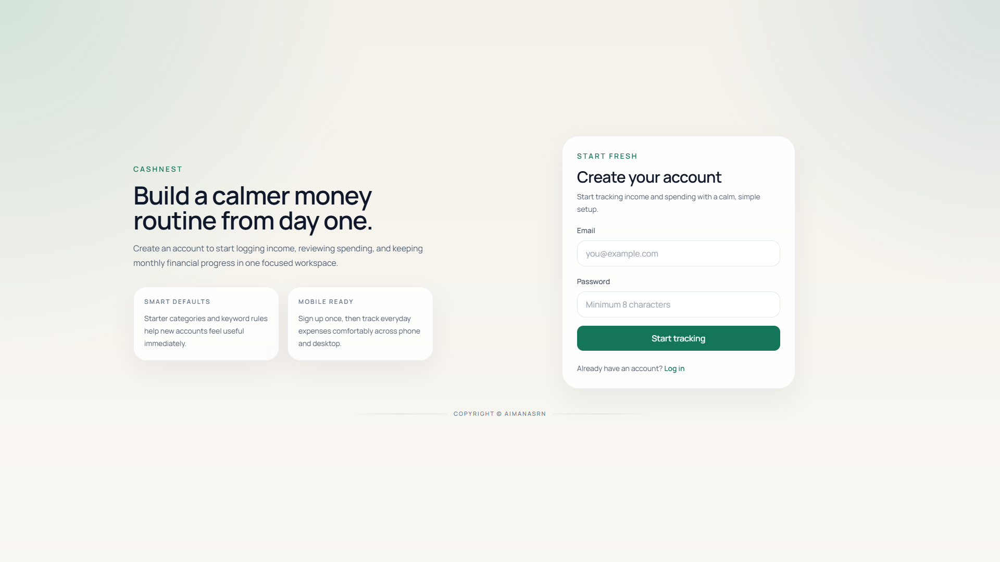
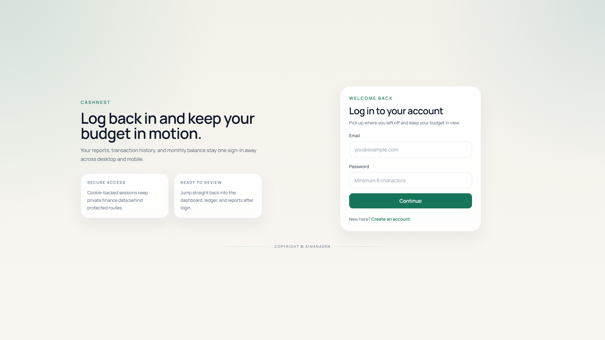
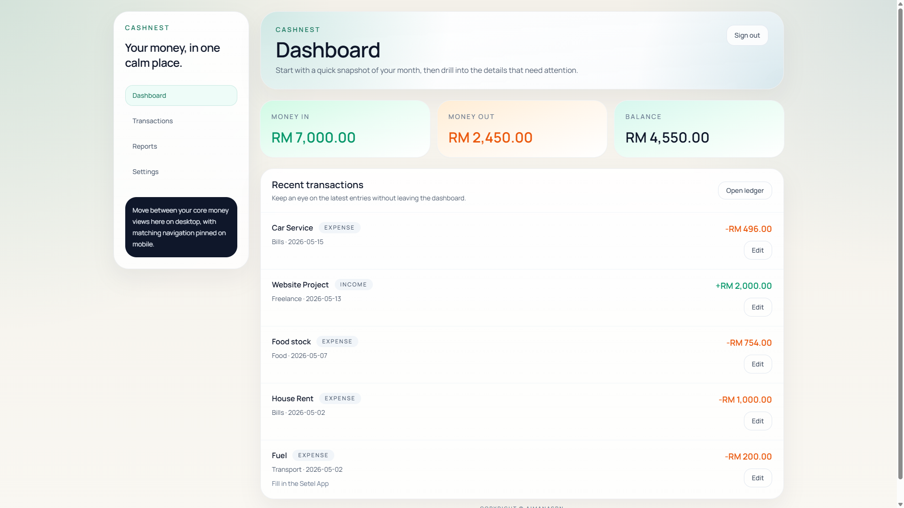
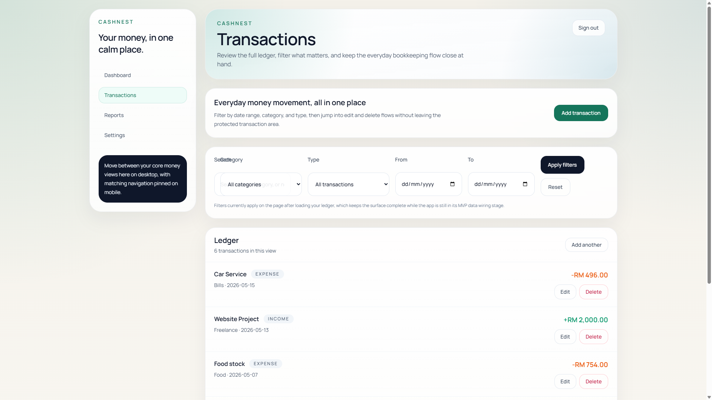
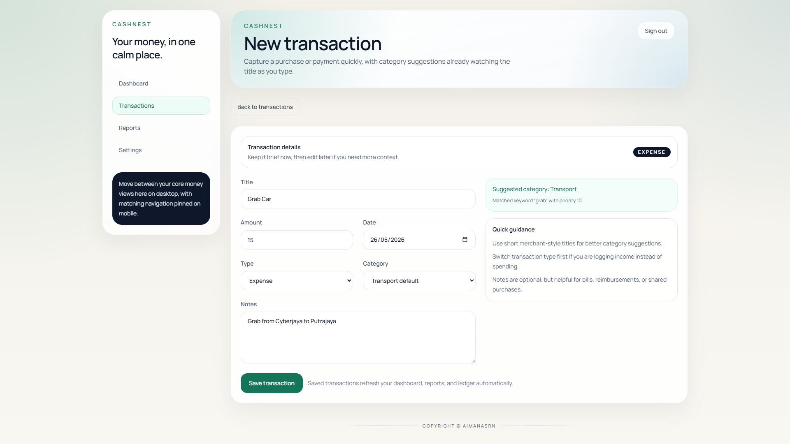
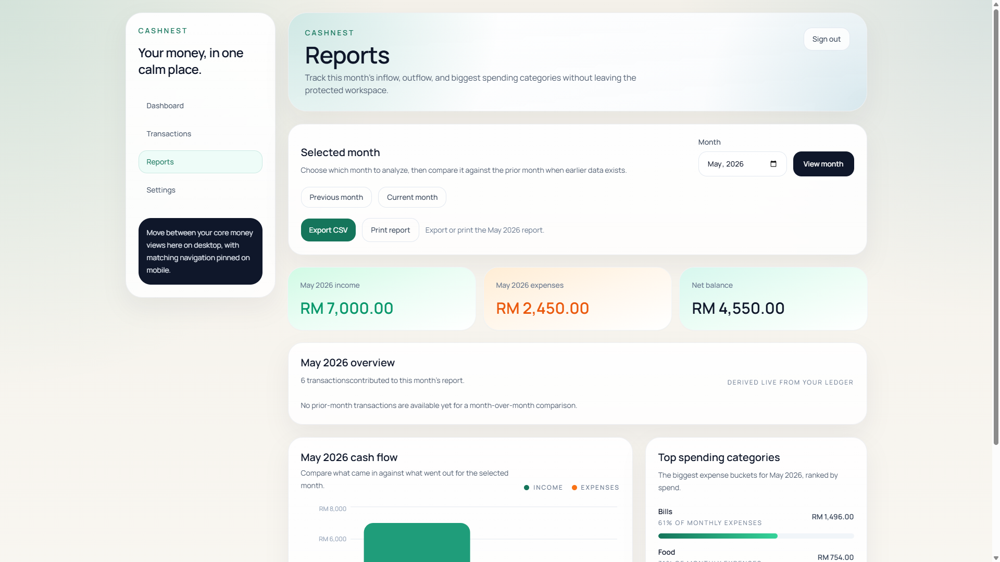
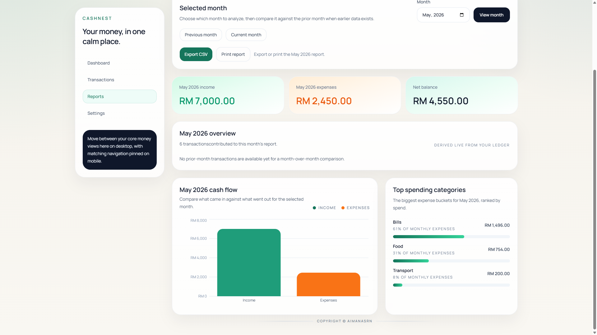
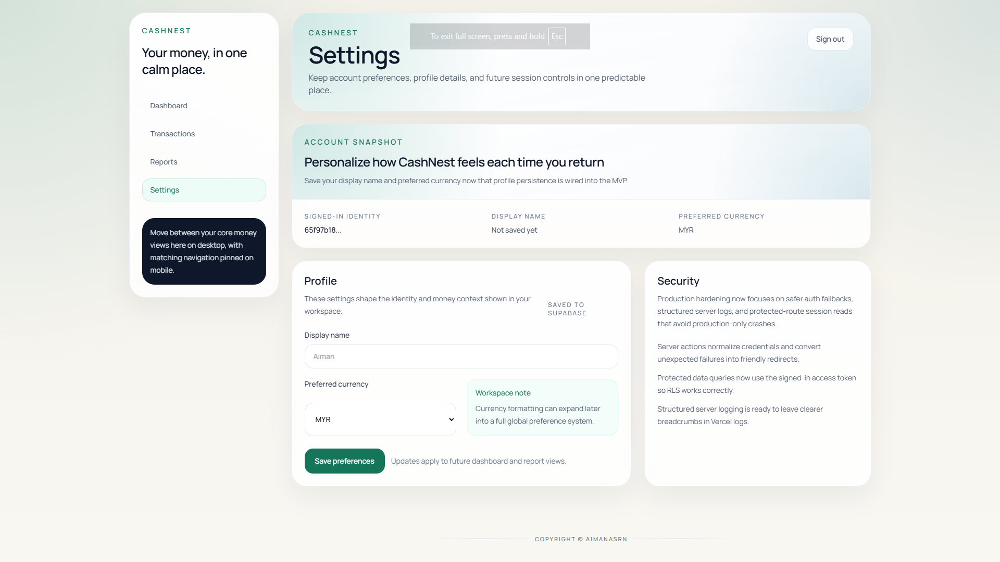

# CashNest

CashNest is a polished personal finance tracker built with `Next.js`, `Tailwind CSS`, and `Supabase`. It helps users track income and expenses, review monthly spending, export reports, and manage money without relying on spreadsheets.

## Features

- Authenticated personal finance dashboard
- Income and expense transaction tracking
- Edit, delete, and filter transactions by date, category, and type
- Auto-category suggestions from transaction title keywords
- Monthly report view with charts and CSV export
- Profile settings for display name and preferred currency
- Mobile-responsive UI with a more premium fintech-style polish

## Tech Stack

- `Next.js` App Router
- `React 19`
- `Tailwind CSS`
- `Supabase` Auth + Postgres
- `Recharts`
- `Vitest` and `Playwright`

## Screenshots

### Landing



### Auth




### Product Gallery








## Local Setup

1. Install dependencies:

```bash
npm install
```

2. Copy the environment file:

```bash
cp .env.example .env.local
```

3. Fill in your Supabase values in `.env.local`.

4. Run the database SQL in Supabase:
   - [supabase/migrations/20260524_init_personal_finance_tracker.sql](./supabase/migrations/20260524_init_personal_finance_tracker.sql)
   - [supabase/migrations/20260525_auth_profile_rls_patch.sql](./supabase/migrations/20260525_auth_profile_rls_patch.sql)
   - [supabase/seed.sql](./supabase/seed.sql)

5. Start the app:

```bash
npm run dev
```

Open `http://localhost:3000`.

## Environment Variables

```env
NEXT_PUBLIC_SUPABASE_URL=https://your-project-ref.supabase.co
NEXT_PUBLIC_SUPABASE_ANON_KEY=your-supabase-anon-key
SUPABASE_SERVICE_ROLE_KEY=your-supabase-service-role-key
```

Use the base Supabase project URL, not the REST URL ending in `/rest/v1/`.

## Scripts

- `npm run dev` - start the local app
- `npm run build` - production build check
- `npm run start` - run the production build locally
- `npm run lint` - lint the project
- `npm run test` - run Vitest
- `npm run test:e2e` - run Playwright tests

## Deployment

Deployment and auth-domain setup notes live in [docs/DEPLOYMENT.md](./docs/DEPLOYMENT.md).

## Testing

Testing commands and verification notes live in [docs/TESTING.md](./docs/TESTING.md).

## Demo And Testing

If friends or reviewers are testing the deployed app:

- Give them the live Vercel URL
- Ask them to create a fresh account instead of reusing one test account
- Make sure Supabase `Site URL` and redirect URLs already match the deployed domain
- Tell them to report the exact action if they hit a `400` or `500`
- Ask for the browser `Network` error and Vercel `Functions` log if auth fails

For cleaner demos:

- Seed a few realistic transactions after signup
- Set a display name and preferred currency in settings
- Show both the dashboard and reports page during walkthroughs

## Production Notes

- Set the same Supabase environment variables in Vercel.
- In Supabase `Authentication > URL Configuration`, set `Site URL` to your deployed app domain.
- Add your deployed domain to Supabase redirect URLs.
- If signup returns `400`, check Supabase auth rate limits, redirect URL config, and Vercel function logs.
- If login succeeds but pages fail after redirect, confirm the SQL migration, profile patch, and seed were applied.

## Current MVP Scope

- Dashboard
- Transactions
- Reports
- Settings
- Auth

Planned next-phase ideas include debt tracking, savings goals, recurring transactions, and AI insights.

## Launch Checklist

- Vercel deployment is live
- Supabase SQL migration, auth patch, and seed have been applied
- Vercel environment variables are set correctly
- Supabase auth domain configuration matches the deployed URL
- `npm run build` passes locally before pushing
- Landing page, signup, login, dashboard, transactions, reports, and settings all work in production
- At least one friend-test pass has been completed on the live app

## Author

Copyright (c) Aimanasrn
